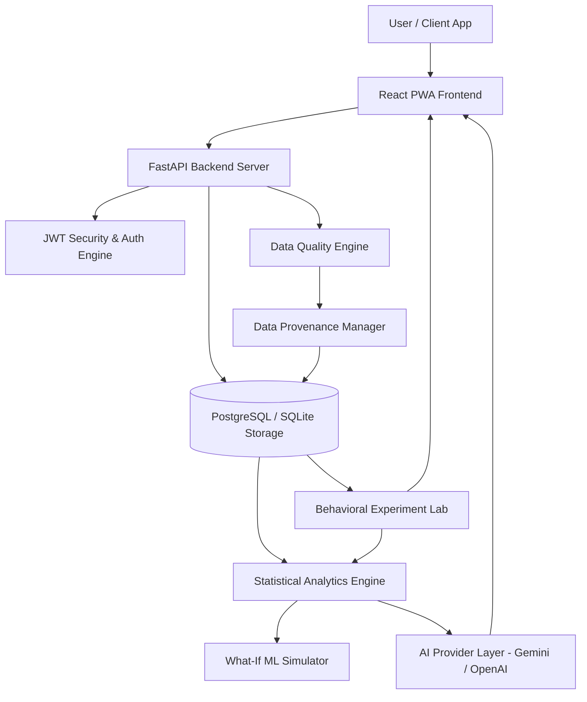

# MindTrace System Architecture

MindTrace is a production-quality behavioral intelligence and psychological self-reflection platform designed for real longitudinal user data.

---

## 1. High-Level Architecture

---

## 2. Core Architectural Pillars

### 1. Real Data Guarantee & Empty-State Principle
- The database starts 100% empty. No fake synthetic records are pre-populated.
- Minimum data thresholds are enforced ($N \ge 14$ paired observations for pairwise correlation matrices). If data is insufficient, system returns explicit progress feedback: *"Not enough real data yet."*

### 2. Evidence-Grounded Explainable AI
- The LLM never invents statistics. A mathematical engine calculates correlation coefficients, sample sizes, and p-values.
- Structured evidence JSON objects are passed to the AI provider for natural language explanation.

### 3. Data Provenance & Source Tracking
- Every record maintains source metadata (`manual`, `health_connect`, `apple_health`), provider name, external record identifiers, and sync timestamps.

### 4. Responsible AI Safety Bounds
- Strictly prohibits mental illness diagnoses (e.g. depression, ADHD, PTSD). All outputs use observational, association-focused terminology.
