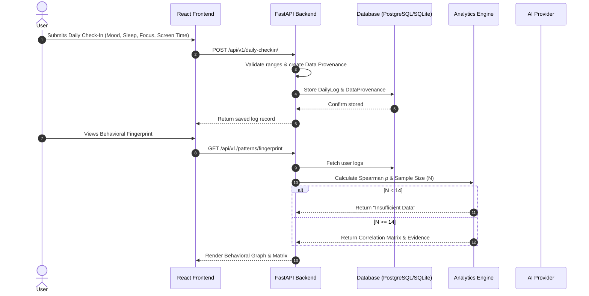

# MindTrace System Design Document

## 1. Sequence Diagram: Data Logging & Analytics Pipeline

---

## 2. Background Workers & Synchronization
- Health Connect & Wearable OAuth APIs run periodic sync jobs updating `sync_jobs` table.
- Provenance engine tags incoming wearable records with `source_type="health_connect"`.
